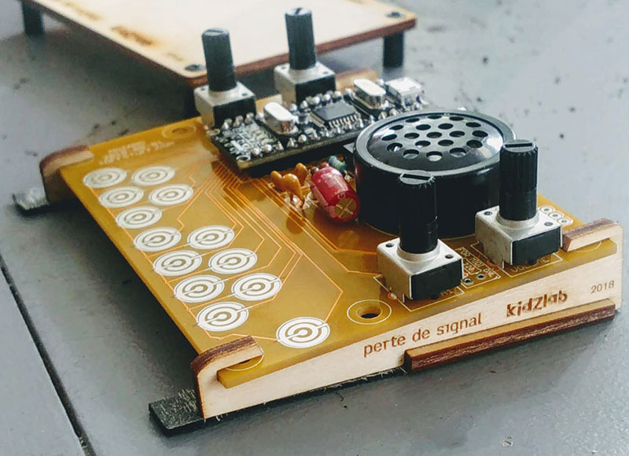
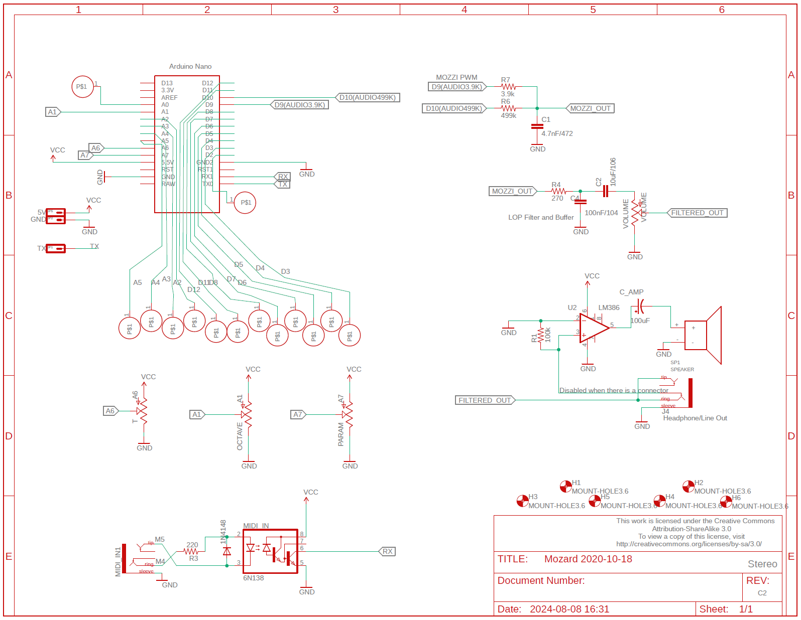

# Mozard

Mozard is a miniature digital synthesizer based on Mozzi and an Arduino Nano ATMEGA328p board.

## Hardware

The circuit and BOM can be found in the extras/circuit folder.

## Software

1) Download the library source code [here](https://github.com/thomasfredericks/Mozard/archive/refs/heads/master.zip).

2) Extract into your Arduino libraries folder. It should look something like this:

3) Open Arduino.

4) Find the latest example:

5) Configure Arduino for the microcontroller (ATMEGA328p with Old Bootloader if you followed a Mozard workshop or bought a clone).

