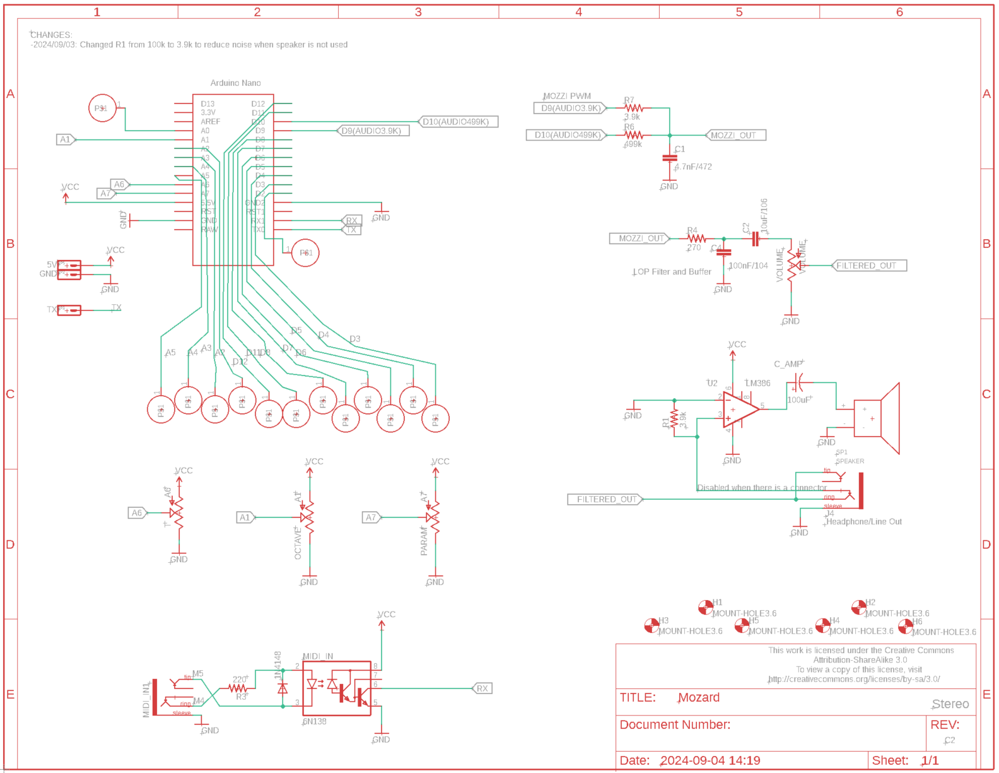

# Mozard

Mozard is a miniature digital synthesizer based on Mozzi and an Arduino Nano ATMEGA328p board.

## Usage

The Mozard changes behavior when the arpeggiator is deactivated or activated. When in arpeggiator mode, the LED on the Arduino blinks in sync with the arpeggiator interval.

## Hardware

The circuit and Bill Of Materials can be found in the extras/circuit folder.

## Source code

1) Download the library source code [here](https://github.com/thomasfredericks/Mozard/archive/refs/heads/master.zip).

2) Extract into your Arduino libraries folder. It should look something like this:

3) Open Arduino.

4) Find the latest example:

5) Configure Arduino for the right microcontroller i.e. "Arduino Nano":

7) Configure Arduino for the right Bootloader i.e. "ATmega328 (Old Bootloader)"  if you followed a Mozard workshop or bought a clone:

8) Compile and transfer.

